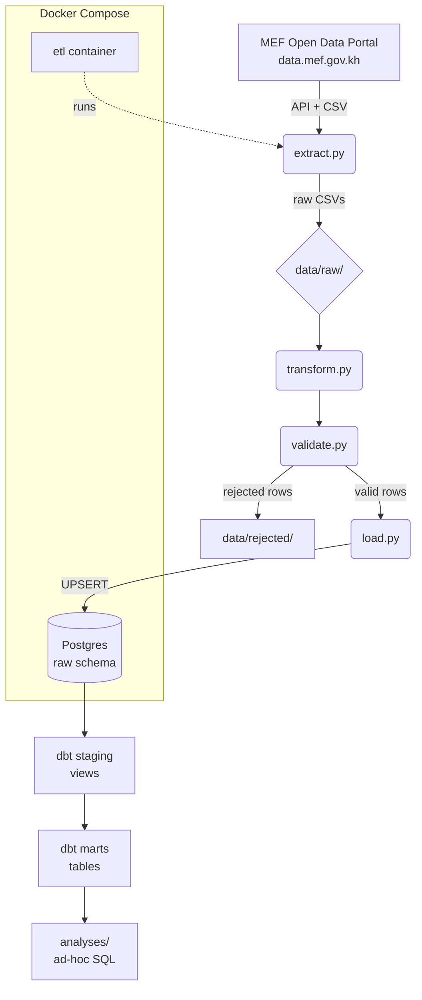

# Cambodia Business Registry Pipeline

> End-to-end data pipeline for Cambodian public data — from API/CSV ingestion to analytics-ready marts.

## Overview

A production-style ETL + analytics project that ingests Cambodian business registration and provincial credit data from the Ministry of Economy and Finance (MEF) open data portal, cleans and validates it, loads it into Postgres, and models it with dbt into business-ready tables.

Built as a portfolio project demonstrating the full data engineering lifecycle: extraction → transformation → validation → loading → modeling → testing → analysis.

## Architecture



## Data Source

- **Portal:** [data.mef.gov.kh](https://data.mef.gov.kh) — Cambodia Ministry of Economy and Finance open data
- **Dataset 1 — New Business Registrations (2022–2024):** fetched via public JSON API (`pd_688aee7f79fe4d000707d9b0`)
- **Dataset 2 — Credit Distribution by Area and Province (2024):** committed as a seed file under `data/seeds/` (source: MEF portal)

## Tech Stack

| Layer | Tools |
|---|---|
| Language | Python 3.11 |
| Data | pandas, requests |
| Database | PostgreSQL 16 (Docker) |
| Transformation | dbt-core 1.12 + dbt-postgres + dbt_utils |
| Config | python-dotenv |
| Containerization | Docker, Docker Compose |
| Logging | Python `logging` (file + console) |

## Project Structure

```
src/                    Python ETL code
  extract.py            fetch from MEF API
  transform.py          clean + rename
  validate.py           quality gates, reject reporting
  load.py               UPSERT into Postgres
  logging_config.py     shared logging setup
main.py                 pipeline entry point
sql/                    Postgres migrations (idempotent)
cambodia_dbt/           dbt project
  models/staging/       staging views
  models/marts/         analytics tables
  analyses/             ad-hoc SQL
  tests/                custom tests
docs/                   architecture, data dictionary, notes, screenshots
data/
  seeds/                small reference CSVs (committed)
  raw/                  API/CSV output (gitignored)
  rejected/             failed validation rows (gitignored)
logs/                   runtime logs (gitignored)
```

## Setup

**Prerequisites:**
- **Python 3.11+** on `PATH` — verify with `python --version`. If not found, either reinstall Python with *"Add Python to PATH"* checked, or use the full path to `python.exe` when running commands.
- **Docker Desktop** running.

### 1. Clone and install

```powershell
git clone https://github.com/prakveasna2025-hash/Cambodia_Business_Registry_Pipeline.git
cd Cambodia_Business_Registry_Pipeline

python -m venv venv
venv\Scripts\activate
pip install -r requirements.txt
pip install dbt-postgres
```

### 2. Configure environment

```powershell
Copy-Item .env.example .env
notepad .env
```

Set a password you'll remember, then save and close.

> **Windows note:** `code .env` may fail because VS Code's CLI strips the leading dot. Use `notepad` instead.
>
> **Password rules:** use only letters, numbers, and underscores. Characters like `@`, `:`, `/`, `?` break the connection URL.
>
> **Order matters:** `.env` must exist **before** `docker compose up`. Otherwise Postgres initializes with a blank user/password, and you'll have to wipe the volume: `docker compose down -v` then `docker compose up -d`.

### 3. Start the database

```powershell
docker compose up -d
docker compose ps
```

Wait until `cambodia_registry_pg` shows `healthy` (about 5 seconds).

### 4. Apply schema migrations

Each migration is idempotent — safe to re-run.

```powershell
Get-Content sql\01_create_raw_schema.sql | docker exec -i cambodia_registry_pg psql -U cam_registry_dev -d cambodia_registry
Get-Content sql\02_create_raw_credit.sql  | docker exec -i cambodia_registry_pg psql -U cam_registry_dev -d cambodia_registry
Get-Content sql\03_registry_unique.sql    | docker exec -i cambodia_registry_pg psql -U cam_registry_dev -d cambodia_registry
```

## How to Run

### Option A — Full pipeline in Docker

Runs extract → transform → validate → load inside a container. Postgres is already running from Setup.

```powershell
docker compose up -d --build
docker compose logs etl
```

Expected: ETL container exits with code 0. Row counts in the DB:
```powershell
docker exec -it cambodia_registry_pg psql -U cam_registry_dev -d cambodia_registry -c "SELECT (SELECT COUNT(*) FROM raw.raw_business_registry) AS registry, (SELECT COUNT(*) FROM raw.raw_credit_by_province) AS credit;"
```

### Option B — Run stages locally

```powershell
# 1. Python ETL
python main.py
```

Then load `.env` values into the current PowerShell session — dbt reads shell env vars, not the `.env` file:

```powershell
Get-Content .env | ForEach-Object { if ($_ -match '^\s*([^#][^=]+?)\s*=\s*(.*?)\s*$') { Set-Item -Path "Env:$($matches[1])" -Value $matches[2] } }
```

Then run dbt:

```powershell
cd cambodia_dbt
dbt deps --profiles-dir ..
dbt build --profiles-dir ..
cd ..
```

Expected: `PASS=26 WARN=0 ERROR=0`.

### Query the results

```powershell
docker exec -it cambodia_registry_pg psql -U cam_registry_dev -d cambodia_registry
```

```sql
SELECT * FROM dbt_dev.mart_registrations_by_year;
SELECT * FROM dbt_dev.mart_credit_by_area;
```

## Data Model

| Layer | Relation | Type | Rows |
|---|---|---|---|
| raw | `raw.raw_business_registry` | table | 12 |
| raw | `raw.raw_credit_by_province` | table | 25 |
| staging | `dbt_dev.stg_business_registry` | view | 12 |
| staging | `dbt_dev.stg_credit_by_province` | view | 25 |
| mart | `dbt_dev.mart_registrations_by_year` | table | 3 |
| mart | `dbt_dev.mart_registrations_by_company_type` | table | 4 |
| mart | `dbt_dev.mart_credit_by_area` | table | 4 |

Full column-level definitions: [`docs/data_dictionary.md`](docs/data_dictionary.md).

## Quality Checks

- **Python validation** — required-field and non-negative checks; rejected rows written to `data/rejected/` with a `reject_reason` column
- **dbt tests (26 passing)**:
  - `not_null` on key columns
  - `unique` + `not_null` on surrogate keys
  - `accepted_values` on categorical columns (company type, area, year)
  - `unique_combination_of_columns` on `(province, reporting_year)` via `dbt_utils`
  - Custom non-negative test (`tests/assert_registration_count_non_negative.sql`)

## Results — Key Insights

From `cambodia_dbt/analyses/`:

- **Phnom Penh holds 44.78% of national credit** — 1 of 25 provinces
- **Phnom Penh has only 13.8% of credit users** (694k of 5.04M) — the money is there, the users aren't
- **The other 24 provinces hold 86% of credit users but only 55% of credit** — underbanked per capita
- **Top 5 provinces carry ~63% of credit** — a strong Pareto distribution
- **Kep is the smallest at 0.20%** of national credit
- **Business registrations peaked in 2023** (11,506) then fell ~17% in 2024 (9,530)
- **Sole Proprietorships dominate** — 56% of all new registrations (2022–2024)

## Screenshots

### Docker stack running


### Pipeline execution log


### dbt build — 26 tests passing


### Sample mart query


### dbt lineage graph


## Limitations

- **Small dataset** — 37 raw rows; architecture is designed to scale but is not stress-tested at volume.
- **Single year for credit** — credit data covers 2024 only; no year-over-year provincial trend.
- **No province-level business registrations** — registration data is national, so credit and registrations cannot be joined at province grain.
- **Two Partnership Company nulls** — real missing data from the source; preserved as `NULL` (documented, not imputed).
- **No CI yet** — tests run locally, not on every push.

## Future Work

- GitHub Actions CI running `dbt build` + pytest on push
- Additional data sources (population, GDP) for per-capita metrics
- Province-level business registration dataset to enable joins with credit
- Publish dbt docs to GitHub Pages
- Migrate raw `registration_count` / `year` columns from `TEXT` to `INTEGER`

## Status

✅ Pipeline complete — end-to-end ETL + analytics

- 37 raw rows ingested and cleaned
- 26 dbt tests passing
- 3 analytics marts, 4 business analyses
- Fully containerized (Postgres + ETL)