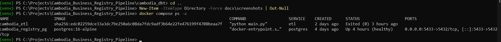
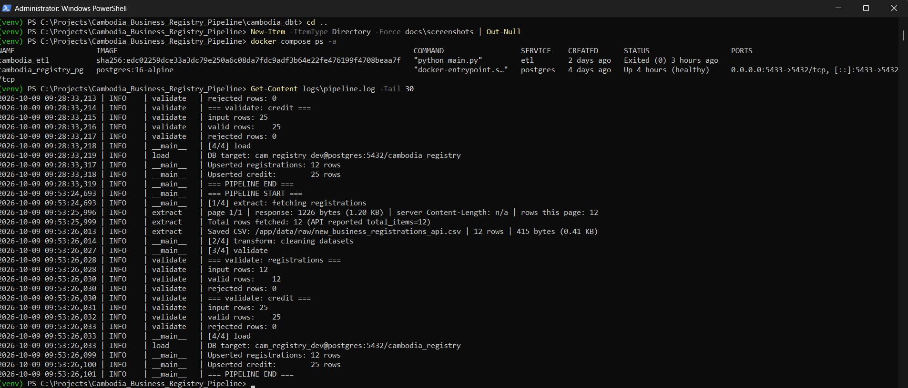
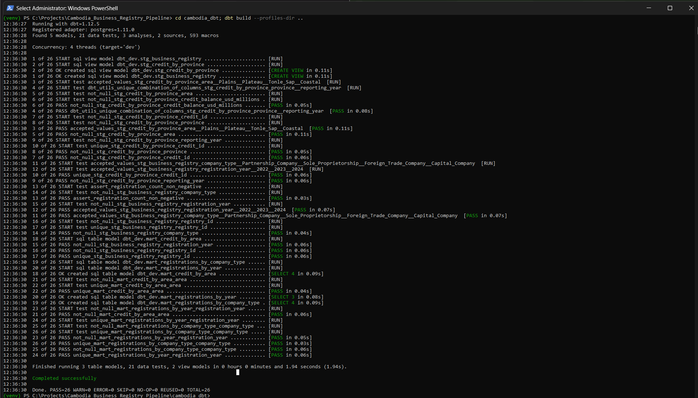
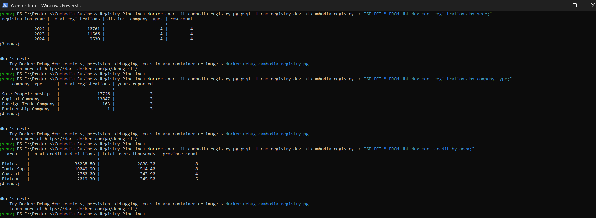
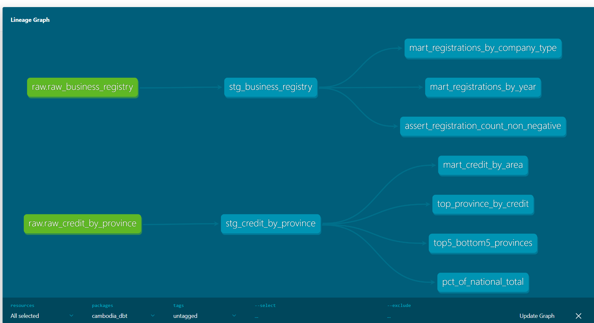

# Cambodia Business Registry Pipeline

## Goal
A data pipeline that ingests, cleans, and stores Cambodian business registry data for analysis and querying. Built as a learning + portfolio project.

## Tech Stack
- Python 3.x
- pandas
- requests
- pytest
- SQL (planned)
- Docker (planned)

## Project Structure
src/ – pipeline code
test/ – unit tests
data/ – raw and processed data (gitignored, .gitkeep only)
sql/ – SQL schemas and queries
logs/ – runtime logs (gitignored)
main.py – entry point

## Architecture

(or just the mermaid block inline — see below)

## Screenshots

### Docker stack

### Pipeline log

### dbt build (26 tests passing)

### Sample mart query

### dbt lineage

## Key insights

From `cambodia_dbt/analyses/`:

- **Phnom Penh holds 44.78% of national credit** (1 of 25 provinces)
- **Phnom Penh has only 13.8% of credit users** — the money is there, the users aren't
- **24 other provinces hold 86% of credit users but only 55% of credit**
- **Top 5 provinces carry ~63% of credit** — a strong Pareto distribution
## Status

✅ **Pipeline complete** — end-to-end ETL + analytics

- 4 datasets ingested and cleaned
- 26 dbt tests passing
- 3 analytics marts
- 4 business analyses

🚧 **Future work**: CI/CD, dbt Cloud, additional data sources