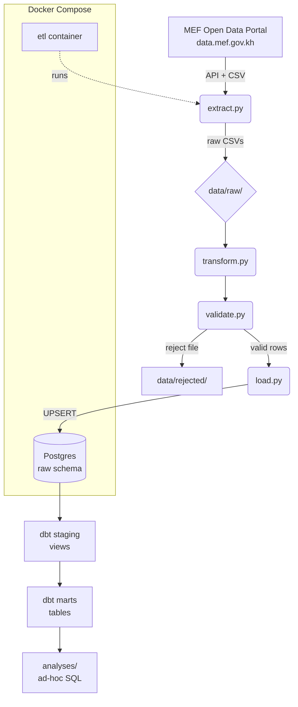

# Architecture

```mermaid
flowchart TD
    A[MEF Open Data Portal<br/>data.mef.gov.kh] -->|API + CSV| B(extract.py)
    B -->|raw CSVs| C{data/raw/}
    C --> D(transform.py)
    D --> E(validate.py)
    E -->|reject file| F[data/rejected/]
    E -->|valid rows| G(load.py)
    G -->|UPSERT| H[(Postgres<br/>raw schema)]
    H --> I[dbt staging<br/>views]
    I --> J[dbt marts<br/>tables]
    J --> K[analyses/<br/>ad-hoc SQL]
    
    subgraph Docker Compose
        H
        L[etl container]
    end
    
    L -.runs.-> B
```